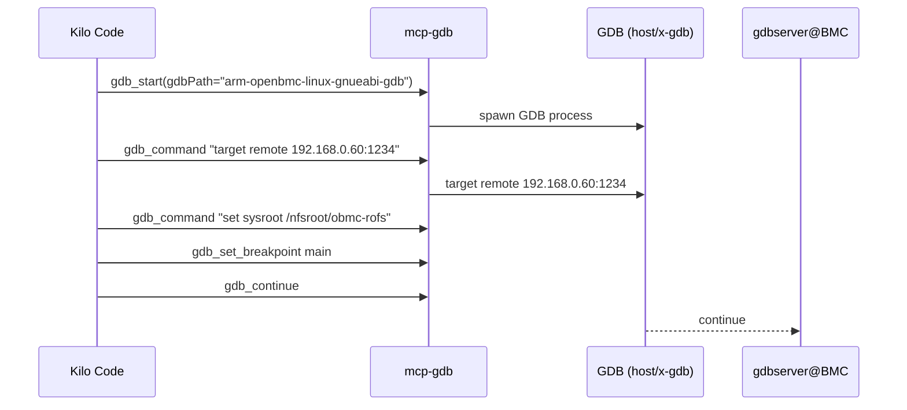
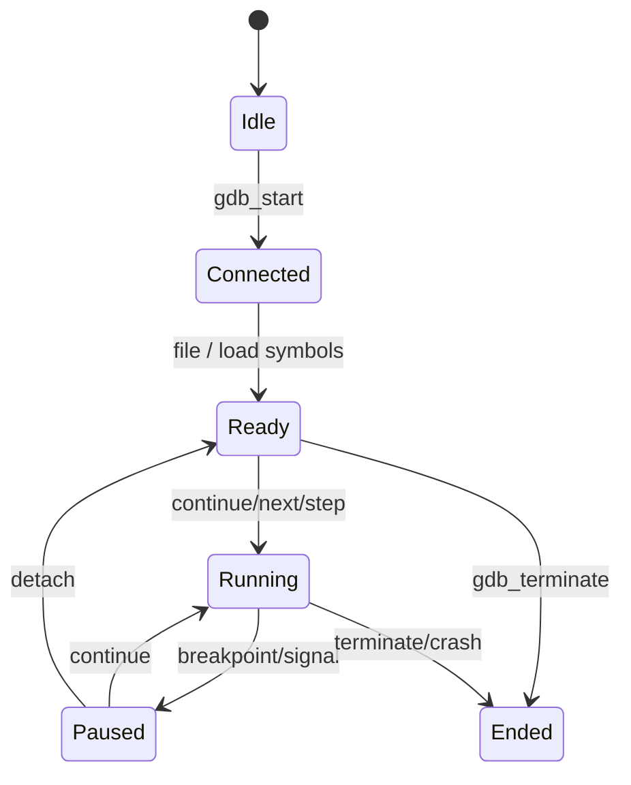

# 在 mcp-gdb + Kilo Code 中可结合 LLM 生成的 Mermaid 图示例

本文汇总在使用 mcp-gdb 进行动态调试（含远程 gdbserver/NFS 等场景）时，LLM 可以产出的 Mermaid 图类型与示例，以便在 Kilo Code 中快速可视化调试流程、调用关系或数据流。

## 使用建议
- 先在 Kilo Code 中通过 MCP 启动 gdb 会话，获取必要的调试上下文（加载的二进制、断点、`info threads`/`bt` 等）。
- 向 LLM 描述你已有的上下文、想要呈现的角度（如启动流程、线程关系、数据流），并附上关键命令输出；LLM 即可用 Mermaid 生成图形。
- 生成的 Mermaid 代码可直接在支持 Mermaid 的 Markdown 预览/插件中渲染。

## 常见图形类型与场景

### 1. 调试流程时序图（sequenceDiagram）
展示宿主机、gdb、远程 gdbserver/设备之间的交互命令，适合解释“启动/连接/加载符号/继续运行”的步骤。



### 2. 调试会话状态机（stateDiagram-v2）
描述会话在“未启动 → 已连接 → 加载符号 → 运行/暂停 → 结束”间的转换，适合文档化团队约定或自动化脚本逻辑。



### 3. 源码与符号映射（flowchart）
在 NFS 或交叉调试场景下，展示 `set sysroot`、`set substitute-path` 如何把宿主机路径映射到目标根文件系统。

```mermaid
flowchart TB
    A[宿主机 /nfsroot/obmc-rofs/usr/src/debug] -->|set substitute-path| B[/usr/src/debug]
    C[宿主机 /nfsroot/obmc-rofs/usr/bin/app] -->|file| D[目标二进制符号加载]
    D --> E[break main / continue]
```

### 4. 多线程/任务关系图（graph TD）
结合 `info threads`、`thread apply all bt` 的输出，可绘制线程之间的职责或关键调用栈的简化视图。

```mermaid
graph TD
    T1[Thread 1: event-loop] --> F1[select()/epoll_wait]
    T2[Thread 2: worker A] --> F2[process_request]
    T3[Thread 3: worker B] --> F3[process_request]
    F1 -->|dispatch| F2
    F1 -->|dispatch| F3
```

### 5. 数据流/消息流图（flowchart 或 sequence）
对于 D-Bus/REST 等路径，可把 `print`/`monitor` 输出抽象为节点，展示关键数据在模块间的流动。


### 6. 断点与异常定位示意（timeline 或 flowchart）
可以用 timeline（Mermaid 10 支持）或普通流程图突出“事件顺序 + 调用栈摘录”，帮助复现或复盘。

```mermaid
timeline
    title Crash reproduction
    section Run
      Start gdbsession: T0
      set breakpoint main: T1
      continue: T2
    section Fault
      hit breakpoint in handler(): T3
      backtrace shows null deref at foo.cpp:128: T4
      print request_id -> 0x0: T5
```

## 如何向 LLM 描述需求
- 给出**上下文**：GDB 目标、是否远程、是否使用 NFS/sysroot、关键命令输出（`bt`、`info threads`）。
- 指定**图类型**：如 “请用 sequenceDiagram 展示宿主机与 gdbserver 的交互”。
- 标明**重点**：例如需要突出 `set substitute-path` 的路径映射，或某个线程的调用栈。
- 要求**可复制的 Mermaid 代码**，便于直接粘贴到 Markdown 预览或 PR 描述中。

通过以上方法，你可以把动态调试的流程和发现快速转换成可视化 Mermaid 图，方便在 Kilo Code 中回顾、协作与分享。

## 单图提示词速查
- 时序图：`docs/mermaid-prompts/sequence-diagram.md`
- 状态机：`docs/mermaid-prompts/state-machine.md`
- 路径映射：`docs/mermaid-prompts/path-mapping.md`
- 线程关系：`docs/mermaid-prompts/thread-graph.md`
- 数据流：`docs/mermaid-prompts/data-flow.md`
- 时间线/故障：`docs/mermaid-prompts/crash-timeline.md`
