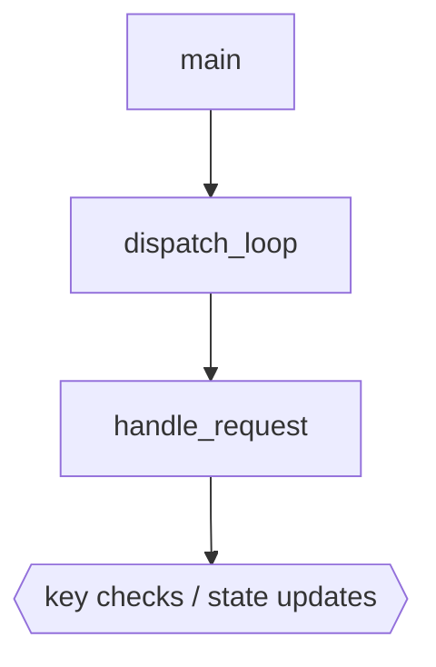
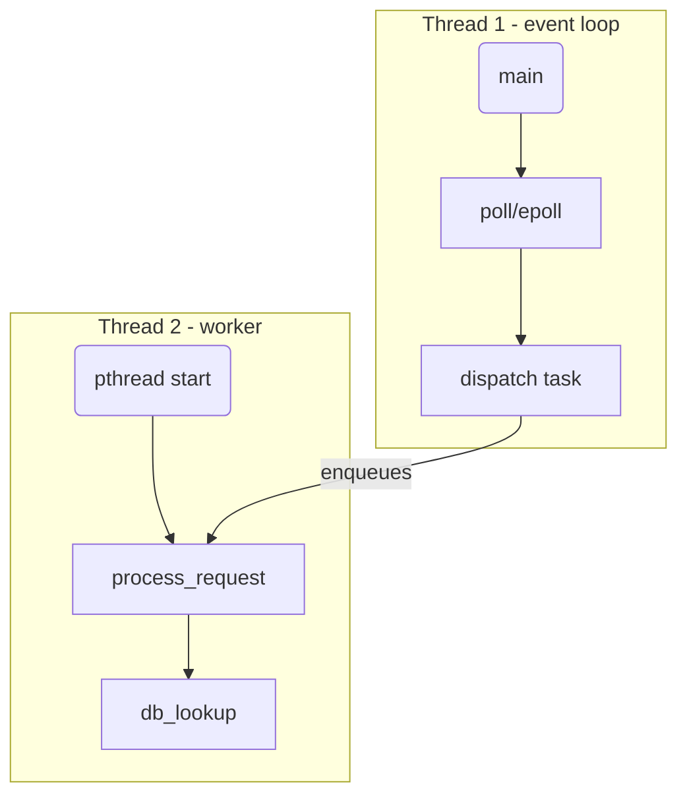
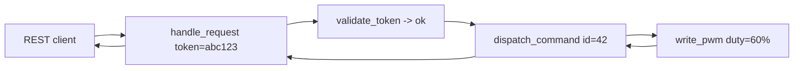
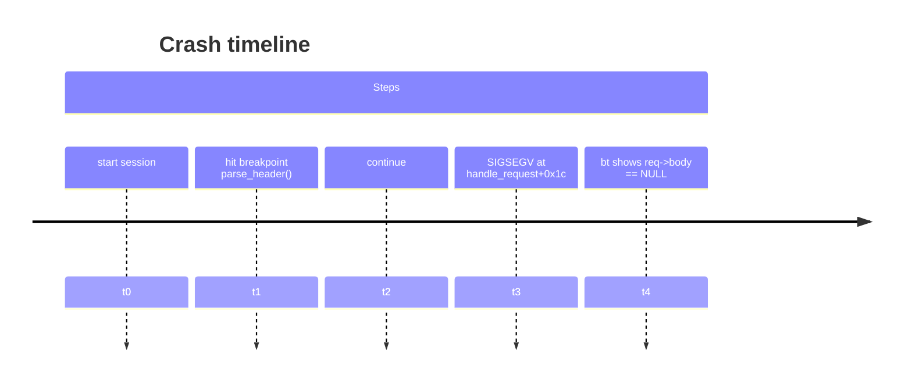

# 用 mcp-gdb + LLM 生成动态函数调用 Mermaid 图

本文演示如何在 Kilo Code / MCP 工作流中，把 GDB 采集到的**真实运行信息**交给 LLM，总结并输出 Mermaid 图（如函数调用图、线程调用链、请求流等），用于快速理解代码行为。

## 工作流概览
1. **启动调试会话**：在 Kilo Code 中调用 `gdb_start`（必要时传入交叉 GDB 的 `gdbPath`）。
2. **准备更易解析的输出**：
   - `gdb_command: "set pagination off"`
   - `gdb_command: "set print pretty on"`
   - 需要日志时启用：`gdb_command: "set logging file /tmp/gdb.log"`，`gdb_command: "set logging on"`
3. **采集动态上下文**（举例）：
   - 命中断点后：`gdb_backtrace`、`gdb_command: "info args"`、`gdb_command: "info locals"`
   - 线程全局视图：`gdb_command: "thread apply all bt"`
   - 关键路径：在热点函数前后下断点或使用 `finish/step/next` 收集多段 `bt`/`info args`。
4. **把原始输出交给 LLM**：粘贴上述命令结果，并说明想要的图形类型与关注点（例：函数调用链、线程间调度、请求流向）。
5. **渲染 Mermaid**：LLM 会根据输出给出 Mermaid 代码，你可在 Kilo Code 的 Markdown 预览或其他工具中渲染。

## 示例 1：函数调用链（基于 backtrace）
当断点命中后，使用 `gdb_backtrace`，并将输出贴给 LLM，请求生成函数调用图：

```
# 示例 backtrace 片段
#0  handle_request (req=0x7f...) at http/server.cpp:128
#1  dispatch_loop() at http/server.cpp:88
#2  main() at main.cpp:42
```

可要求 LLM 生成如下 Mermaid：



> 小技巧：如果 backtrace 较长，可让 LLM“仅保留与模块 X 相关的帧”或“折叠标准库帧”。

## 示例 2：线程调用链（`thread apply all bt`）
将多线程栈粘贴给 LLM，说明“按线程分组并画出调用链”即可得到类似结构：



## 示例 3：请求/数据流（结合打印或监视点）
在关键函数设置断点并查看参数/局部变量（`info args`/`info locals`），或使用 `display`/`watch` 记录关键字段。将截获的值告诉 LLM，可生成数据流图：



## 示例 4：崩溃/异常时间线
把命令序列与对应时间节点（或日志行）整理后，请求 LLM 输出 timeline：



## 还能输出哪些 Mermaid 图？
在将运行期信息提供给 LLM 时，可额外请求以下可视化，帮助聚合更多调试信号：

- **状态机/错误迁移图**：将 `info registers`、`info locals` 中的状态字段或日志标签标注在转换上，用 `stateDiagram-v2` 表示状态跳转与错误分支。

  ```mermaid
  stateDiagram-v2
    [*] --> Init
    Init --> Handshake: recv SYN
    Handshake --> Auth: token ok
    Handshake --> Error: timeout / retry > 3
    Auth --> Ready: session_id set
    Ready --> Error: watchdog reset
  ```

- **时序图（跨进程/跨线程交互）**：结合 `thread apply all bt` 与日志时间戳，要求按「客户端/守护进程/工作线程」分泳道画 `sequenceDiagram`，突出消息与锁顺序，定位死锁或延迟。

  ```mermaid
  sequenceDiagram
    participant CLI
    participant Daemon
    participant Worker
    CLI->>Daemon: send RPC start_job
    Daemon->>Worker: queue job (holds mutex A)
    Worker-->>Daemon: ack (waiting on lock B)
    Daemon-->>CLI: pending...
    CLI->>Daemon: cancel
    Daemon->>Worker: cancel job
  ```

- **资源依赖/锁关系图**：把 `info threads` 与 `thread apply all bt` 中的锁名/资源名提取为节点，用 `graph LR` 展示谁持有/等待哪些锁，辅助发现死锁路径。

  ```mermaid
  graph LR
    T1[Thread 1] -- holds --> L1[mutex A]
    T1 -- waiting --> L2[mutex B]
    T2[Thread 2] -- holds --> L2
    T2 -- waiting --> L1
    T3[Thread 3] -- holds --> L3[DB conn]
  ```

- **对象/会话生命周期**：结合 `watch`/`display` 记录的创建/释放事件，用 `flowchart LR` 或 `stateDiagram` 标注从创建到回收的关键节点，检查泄漏或重复释放。

- **跨线程 / CPU 占用时间线（Gantt）**：将 `info threads`、`thread apply all bt` 搭配带时间戳的日志，整理每个线程的活动窗口，使用 `gantt` 展示长耗时区段、等待锁的间隔。

  ```mermaid
  gantt
    title Worker threads runtime
    dateFormat  HH:mm:ss
    section Thread-1
      run handler          :done, 12:01:00, 10s
      wait mutex A         :active, 12:01:10, 3s
    section Thread-2
      db query             :done, 12:01:02, 5s
      backoff retry        :crit, 12:01:07, 6s
  ```

- **事件因果 / Trace Map（基于 watch/log）**：把 `watch`/`display` 捕获的字段变更与日志顺序关联，用 `graph TD` 画出“事件 -> 触发函数 -> 后续效果”，帮助定位哪次写入导致错误状态。

  ```mermaid
  graph TD
    W1[write cfg.mode=debug] --> F1(apply_config)
    F1 --> E1[opens /tmp/log] --> F2[log_rotation]
    W2[write cfg.mode=release] --> F1
    F2 --> Crash[SIGBUS on close]
  ```

- **对象关系 / 运行时拓扑**：结合 `ptype`、`info locals` 中的指针关系或容器成员，使用 `classDiagram` 或 `graph LR` 勾勒“连接/会话/缓存”等实例之间的引用，快速发现悬挂指针或循环引用。

  ```mermaid
  classDiagram
    class Session {
      +int id
      +Conn* conn
      +Cache* cache
    }
    class Conn {
      +int fd
      +bool closed
    }
    class Cache {
      +map<int, Entry> entries
    }
    Session --> Conn
    Session --> Cache
  ```

这些图形都可以直接基于 GDB 的实时输出生成，只需在提示中说明你关心的参与者、状态字段或资源名称，LLM 就能将调试片段汇总为对应的 Mermaid 代码。

## 提示与最佳实践
- 让 LLM 知道**目标二进制与符号路径**：在对话中补充 `file ...`、`set sysroot ...`、`set substitute-path ...` 的设定，避免路径混淆。
- **分批提供输出**：backtrace 和多线程栈可能很长，可分段发送，并要求 LLM 仅聚合关键信息。
- **突出你关心的内容**：例如“只画与 I2C 读写相关的调用链”“忽略 libstdc++/libc”。
- 如果需要**实时追踪**，可在关键函数前后反复 `bt/finish/step`，并让 LLM 用最新片段更新图形。

通过以上步骤，你可以借助 mcp-gdb 提供的命令输出，让 LLM 快速总结动态行为并产出可视化的 Mermaid 图，帮助理解和分享调试结果。
